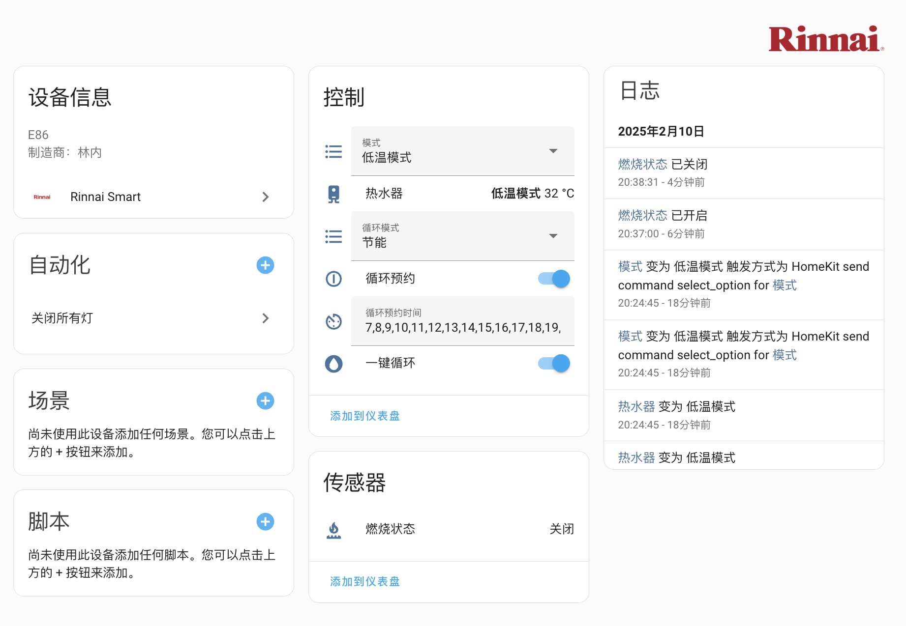

# Rinnai Smart for Home Assistant

Support for [Rinnai Smart Water Heater (E86) monitoring and control device](https://www.rinnai.com.cn/productDetail-646a2c67-29d6-4aff-8ff2-167cc1d33367.html) for Home Assistant.

## WARNING

* **RINNAI DOESN'T PROVIDE ANY OFFICIALLY SUPPORTED API, THUS THEIR CHANGES MAY BREAK HASS INTEGRATIONS AT ANY TIME.**
* **USE IT AS YOUR OWN RISK. YOUR ACCOUNT MAY BE BANNED.**
* **THIS INTEGRATION IS IN ALPHA STATE. ONCE CONNECTION LOST, RECONFIGURE THE DEVICE AGAIN.**

## IMPORTANT NOTES

* **THIS LIBRARY ONLY WORKS ON RUS-R16E86FBF.**

### Features

- water heater:
    * set operating temperature (&deg;C)
    * set operating mode
- set recirculation mode
- set recirculation reservation
- set temporary recirculation
- multiple Rinnai devices

## Installation

#### Versions

The 'main' branch of this custom component is considered unstable, alpha quality and not guaranteed to work.
Please make sure to use one of the official release branches when installing using HACS, see [what has changed in each version](https://github.com/catro/rinnai_smart/releases).

#### With HACS

#### Manual
1. Copy the `rinnai_smart` directory from `custom_components` in this repository and place inside your Home Assistant's `custom_components` directory.
2. Restart Home Assistant
3. Follow the instructions in the `Setup` section

> [!WARNING]
> If installing manually, in order to be alerted about new releases, you will need to subscribe to releases from this repository.

# Setup

> [!Tip]
> If you are unable to use the button above, follow the steps below:
> 1. Navigate to the Home Assistant Integrations page `(Settings --> Devices & Services)`
> 2. Click the `+ ADD INTEGRATION` button in the lower right-hand corner
> 3. Search for `Rinnai Smart`